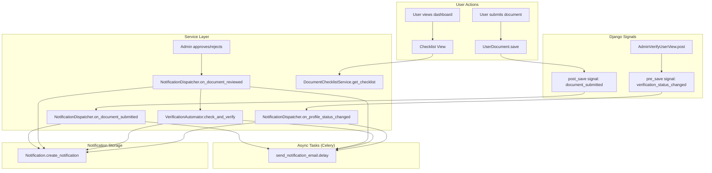

# Design Document: Document Verification Workflow

## Overview

This design implements a complete document verification workflow for the Pratik platform. The system defines required documents per user type, tracks submission progress via a checklist, notifies admins and users of document events, sends branded HTML emails asynchronously via Celery, and provides pre-established rejection templates for consistent admin feedback.

The design extends existing models (UserDocument, Notification) and views (admin dashboard, document views) rather than replacing them. New components are added as a service layer (`DocumentChecklistService`) and Celery tasks, with Django signals wiring everything together.

## Architecture



### Key Design Decisions

1. **Service layer over fat models**: Business logic lives in `DocumentChecklistService`, `NotificationDispatcher`, and `VerificationAutomator` — not in models or views. This keeps models focused on data and views focused on HTTP.

2. **Django signals for decoupling**: Document submission and profile status changes trigger signals. The notification/email logic subscribes to these signals, keeping the views clean.

3. **Extend, don't replace**: We add new document types and notification types to existing models via migration. Existing admin views are extended with rejection templates and checklist awareness.

4. **Rejection templates as constants**: Stored as a Python constant (list of tuples) in the service layer, not in the database. They rarely change and don't need admin CRUD.

5. **Celery for emails only**: In-app notifications are created synchronously (fast DB insert). Emails are sent asynchronously via Celery to avoid blocking requests.

## Components and Interfaces

### 1. DocumentChecklistService

Location: `core/services/document_checklist_service.py`

```python
class DocumentChecklistService:
    """Determines required documents per user type and computes checklist status."""

    # Mapping: user_type -> list of required document_type codes
    REQUIRED_DOCUMENTS: dict[str, list[str]]

    def get_required_document_types(self, user_type: str) -> list[str]:
        """Return list of required document type codes for a user type."""

    def get_checklist(self, user: CustomUser) -> list[ChecklistItem]:
        """Return checklist items with status for each required document."""

    def get_completion_percentage(self, user: CustomUser) -> int:
        """Return 0-100 percentage of approved documents vs required."""

    def are_all_required_approved(self, user: CustomUser) -> bool:
        """Return True if every required document has status 'approved'."""

    def get_missing_document_types(self, user: CustomUser) -> list[str]:
        """Return document types that are missing or rejected."""
```

```python
@dataclass
class ChecklistItem:
    document_type: str
    label: str           # French display label
    status: str          # 'missing' | 'pending' | 'approved' | 'rejected'
    document_id: int | None  # PK of the UserDocument if exists
    uploaded_at: datetime | None
```

### 2. NotificationDispatcher

Location: `core/services/notification_dispatcher.py`

```python
class NotificationDispatcher:
    """Creates in-app notifications and triggers async email tasks."""

    def on_document_submitted(self, document: UserDocument) -> None:
        """Notify all admins of new document submission."""

    def on_document_approved(self, document: UserDocument) -> None:
        """Notify document owner of approval."""

    def on_document_rejected(self, document: UserDocument, reason: str) -> None:
        """Notify document owner of rejection with reason."""

    def on_profile_verified(self, user: CustomUser) -> None:
        """Notify user that profile is verified."""

    def on_profile_status_changed(self, user: CustomUser, old_status: str, new_status: str, note: str) -> None:
        """Notify user of profile status change (rejected/suspended/incomplete)."""
```

### 3. VerificationAutomator

Location: `core/services/verification_automator.py`

```python
class VerificationAutomator:
    """Checks if all required documents are approved and auto-verifies the profile."""

    def check_and_verify(self, user: CustomUser, admin: CustomUser) -> bool:
        """
        If all required documents are approved, verify the user profile.
        Returns True if profile was auto-verified, False otherwise.
        """
```

### 4. Email Service (Celery Tasks)

Location: `core/tasks/email_tasks.py`

```python
@shared_task(bind=True, max_retries=3, default_retry_delay=60)
def send_document_approved_email(self, document_id: int) -> None:
    """Send approval email to document owner."""

@shared_task(bind=True, max_retries=3, default_retry_delay=60)
def send_document_rejected_email(self, document_id: int, reason: str) -> None:
    """Send rejection email with reason to document owner."""

@shared_task(bind=True, max_retries=3, default_retry_delay=60)
def send_profile_verified_email(self, user_id: int) -> None:
    """Send profile verification confirmation email."""

@shared_task(bind=True, max_retries=3, default_retry_delay=60)
def send_profile_status_email(self, user_id: int, new_status: str, note: str) -> None:
    """Send profile status change email (rejected/suspended)."""

@shared_task(bind=True, max_retries=3, default_retry_delay=60)
def send_document_submitted_admin_email(self, document_id: int) -> None:
    """Send new document notification email to all admins."""
```

### 5. Rejection Templates

Location: `core/services/notification_dispatcher.py` (constant)

```python
REJECTION_TEMPLATES: list[tuple[str, str]] = [
    ('illegible', 'Document illisible ou de mauvaise qualité'),
    ('expired', 'Document expiré'),
    ('wrong_type', 'Mauvais type de document'),
    ('incomplete', 'Informations manquantes ou incomplètes'),
    ('non_compliant', 'Document non conforme aux exigences'),
    ('wrong_user', 'Le document ne correspond pas à l\'utilisateur'),
]
```

### 6. Django Signals

Location: `apps/users/signals.py` (extended)

```python
@receiver(post_save, sender=UserDocument)
def on_document_saved(sender, instance, created, **kwargs):
    """When a new document is created, notify admins."""

@receiver(pre_save, sender=CustomUser)
def on_user_verification_status_change(sender, instance, **kwargs):
    """When verification_status changes, notify the user."""
```

### 7. Extended Admin Views

Location: `apps/dashboard/views_admin.py` (modified)

- `AdminDocumentRejectView`: Add rejection template selection to POST handling
- `AdminDocumentApproveView`: Call `VerificationAutomator.check_and_verify` after approval
- `AdminVerifyUserView`: Trigger `NotificationDispatcher.on_profile_status_changed`

### 8. Checklist Dashboard Views

Location: `apps/dashboard/views_documents.py` (extended)

- `DocumentListView`: Add checklist context via `DocumentChecklistService`
- `DocumentCreateView`: Pre-filter document types to missing/rejected required types

## Data Models

### UserDocument Model Extensions

New document types added to `DOCUMENT_TYPES`:

```python
('address_proof', 'Justificatif de domicile'),
('kbis_siret', 'Extrait Kbis/SIRET'),
('representative_id', 'Pièce d\'identité du représentant'),
('accreditation', 'Agrément/Accréditation'),
('partnership_proof', 'Document justificatif du partenariat'),
```

Updated `clean()` validation to use `DocumentChecklistService.REQUIRED_DOCUMENTS` mapping plus `['other']` for each user type.

### Notification Model Extensions

New notification types added to `NOTIFICATION_TYPES`:

```python
DOCUMENT_SUBMITTED = 'document_submitted'
DOCUMENT_APPROVED = 'document_approved'
DOCUMENT_REJECTED = 'document_rejected'
PROFILE_VERIFIED = 'profile_verified'
PROFILE_REJECTED = 'profile_rejected'
PROFILE_SUSPENDED = 'profile_suspended'
PROFILE_INCOMPLETE = 'profile_incomplete'
```

The `notification_type` field `max_length` may need to increase from 30 to 50 to accommodate longer type names.

### Required Documents Mapping

```python
REQUIRED_DOCUMENTS = {
    'driver': ['id_card', 'address_proof', 'driver_license', 'vehicle_insurance', 'vehicle_registration'],
    'landlord': ['id_card', 'address_proof', 'property_proof', 'home_insurance'],
    'company': ['kbis_siret', 'representative_id'],
    'school': ['accreditation', 'representative_id'],
    'partner': ['id_card', 'partnership_proof'],
}
```

User types not in this mapping (student, recruiter, training_center, admin) have no required documents and no verification checklist.

### Email Templates

New templates extending `templates/emails/base_email.html`:

| Template | Purpose |
|---|---|
| `templates/emails/document_approved.html` | Document approval notification |
| `templates/emails/document_rejected.html` | Document rejection with reason |
| `templates/emails/document_submitted_admin.html` | New document alert for admins |
| `templates/emails/profile_verified.html` | Profile verification confirmation |
| `templates/emails/profile_status_changed.html` | Profile rejected/suspended/incomplete |


## Correctness Properties

*A property is a characteristic or behavior that should hold true across all valid executions of a system — essentially, a formal statement about what the system should do. Properties serve as the bridge between human-readable specifications and machine-verifiable correctness guarantees.*

### Property 1: Checklist mapping returns correct document types per user type

*For any* user type in the REQUIRED_DOCUMENTS mapping, calling `get_required_document_types(user_type)` should return exactly the expected list of document type codes, and calling it for a user type not in the mapping should return an empty list. Additionally, the document upload form filter should offer exactly the same set of types (plus 'other') for that user type.

**Validates: Requirements 1.1, 9.2**

### Property 2: Checklist status correctly reflects document submissions

*For any* user with a set of required documents and any combination of submitted documents (with statuses pending/approved/rejected), calling `get_checklist(user)` should return a checklist where each item's status matches: 'approved' if the latest document of that type is approved, 'rejected' if rejected, 'pending' if pending, and 'missing' if no document of that type exists.

**Validates: Requirements 1.3**

### Property 3: Completion percentage equals approved count over required count

*For any* user type and any combination of document statuses, `get_completion_percentage(user)` should equal `floor(approved_required_count / total_required_count * 100)`. If the user type has no required documents, the result should be 100.

**Validates: Requirements 1.4**

### Property 4: Admin notifications created on document submission

*For any* newly submitted document, `on_document_submitted` should create exactly one notification per admin user, and each notification message should contain the document title, the user's display name, and the document type label.

**Validates: Requirements 2.1, 2.2**

### Property 5: User notification created on document approval

*For any* approved document, `on_document_approved` should create exactly one notification for the document owner with notification type DOCUMENT_APPROVED.

**Validates: Requirements 3.1**

### Property 6: Auto-verification when all required documents are approved

*For any* user type with required documents, if every required document type has at least one document with status 'approved', then `check_and_verify` should set `is_verified=True`, `verification_status='verified'`, `verified_at` to a non-null timestamp, and `verified_by` to the admin, and a PROFILE_VERIFIED notification should be created for the user.

**Validates: Requirements 3.2, 3.3**

### Property 7: No auto-verification when documents are incomplete

*For any* user type with required documents, if at least one required document type has no approved document (missing, pending, or rejected), then `check_and_verify` should not change the user's `verification_status` to 'verified'.

**Validates: Requirements 3.4**

### Property 8: User notification on document rejection includes reason

*For any* rejected document and any rejection reason string, `on_document_rejected` should create exactly one notification for the document owner with notification type DOCUMENT_REJECTED, and the notification message should contain the rejection reason.

**Validates: Requirements 4.3**

### Property 9: Document rejection sets user status to incomplete and unverified

*For any* document rejection, the document owner's `verification_status` should be set to 'incomplete' and `is_verified` should be set to False.

**Validates: Requirements 4.4, 4.5**

### Property 10: Profile status change creates corresponding notification

*For any* user and any verification status transition (to verified, rejected, suspended, or incomplete), a notification of the corresponding type (PROFILE_VERIFIED, PROFILE_REJECTED, PROFILE_SUSPENDED, PROFILE_INCOMPLETE) should be created for the user, and the notification message should contain the verification note.

**Validates: Requirements 5.1, 5.2, 5.3, 5.4**

### Property 11: Email task dispatched for every notification event

*For any* notification-triggering event (document approved, document rejected, profile verified, profile status changed, document submitted), the corresponding Celery email task should be called with the correct arguments.

**Validates: Requirements 6.1, 6.2, 6.3, 6.4, 6.5**

### Property 12: Document type validation rejects invalid types per user type

*For any* user type and any document type not in the allowed set for that user type (excluding 'other'), calling `UserDocument.clean()` should raise a `ValidationError`. For any document type in the allowed set (or 'other'), `clean()` should not raise a `ValidationError`.

**Validates: Requirements 8.2**

## Error Handling

### Email Delivery Failures

- Celery tasks use `bind=True, max_retries=3, default_retry_delay=60` for automatic retry on failure
- On final failure after retries, the task logs the error via Python's `logging` module and does not re-raise
- In-app notifications are always created synchronously regardless of email delivery status
- Email failures never block the HTTP response to the admin

### Invalid Document Submissions

- `UserDocument.clean()` raises `ValidationError` with a French message if the document type is not allowed for the user type
- The form displays the validation error to the user

### Missing User Profiles

- If a user has no profile or is of a type with no required documents, the checklist service returns an empty list and 100% completion
- The dashboard template conditionally hides the checklist section

### Concurrent Document Reviews

- Each document approval/rejection is an atomic operation on a single `UserDocument` row
- `VerificationAutomator.check_and_verify` re-queries the database for current document statuses to avoid stale data
- `select_for_update()` is used on the user row during auto-verification to prevent race conditions

## Testing Strategy

### Property-Based Testing

Library: **Hypothesis** (Python property-based testing library)

Each correctness property will be implemented as a Hypothesis test with a minimum of 100 examples. Tests will use `@given` decorators with custom strategies for generating:
- Random user types from the defined set
- Random document type combinations
- Random document statuses (pending/approved/rejected)
- Random rejection reason strings
- Random admin user sets

Each test will be tagged with a comment referencing the design property:
```python
# Feature: document-verification-workflow, Property N: <property_text>
```

### Unit Testing

Unit tests (pytest) will cover:
- Static definitions: rejection templates contain expected entries, notification types are defined, document types are defined
- Edge cases: user with zero documents, user with all documents expired, email backend failure handling
- Integration: signal firing on document save, signal firing on user status change
- View behavior: admin reject view with template selection, admin approve view triggering auto-verification

### Test Organization

```
tests/
  test_document_checklist_service.py    # Properties 1-3, unit tests for checklist
  test_notification_dispatcher.py       # Properties 4-5, 8, 10-11, unit tests for notifications
  test_verification_automator.py        # Properties 6-7, 9, unit tests for auto-verification
  test_document_validation.py           # Property 12, unit tests for model validation
  test_email_tasks.py                   # Unit tests for Celery tasks, error handling
  test_signals.py                       # Unit tests for signal wiring
```
